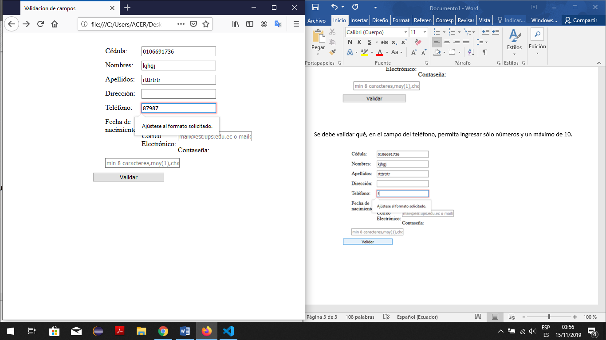

Practica03-Javascript
=====================

Nombre: Christian Yunga

Diseñar una interfaz en HTML que permita ingresar los siguientes campos en un
formulario: cedula, nombres, apellidos, dirección, teléfono, fecha de
nacimiento, correo electrónico y contraseña.

Se debe validar qué, en el campo de la cedula, se ingrese sólo números y que la
misma sea correcta, en base, al último dígito verificador.

Se debe validar qué, en el campo del nombres, ingrese mínimo un nombre y que
permita ingresar sólo letras.

Se debe validar qué, en el campo del apellidos, ingrese mínimo un apellido y que
permita ingresar sólo letras.

Se debe validar qué, en el campo del teléfono, permita ingresar sólo números y
un máximo de 10.

Se debe validar que la fecha de nacimiento ingrese en el formato dd/mm/yyyy.

Se debe validar qué, en el campo correo electrónico, permita ingresar un correo
válido. Se considera un correo válido, cuando comienza por tres o más valores
alfanuméricos, luego un \@, seguido por la extensión “ups.edu.ec” o
“est.ups.edu.ec”.

Se debe validar que la contraseña ingresada tenga mínimo 8 caracteres, además,
debe incluir al menos: una letra mayúscula, una letra minúscula y un carácter
especial (\@, \_, \$)

Diseñar una interfaz en html que tenga tres botones que diga “Anterior”,
“Iniciar”, “Siguiente”, y una imagen. Luego, desde javascript se debe controlar
para al hacer clic sobre uno de los botones realice una acción relacionada a una
galería de imágenes (ver ejemplo, <https://gihp4c.blog.ups.edu.ec/>)

Repositorio git : <https://github.com/ChristianY1/Practica03-Javascript.git>

